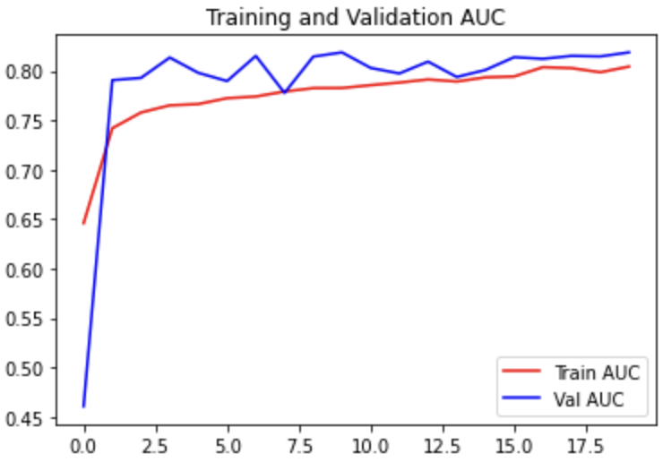

# Pneumonia Detection in Pediatric Chest X-rays using Transfer Learning

This project considers chest X-ray images and builds models for pneumonia classification. X-ray images can distinguish between air, bone, tissue and fluid by virtue of the amount of incident X-rays they absorb. Since pneumonia occurs when air in the lungs is replaced by fluid, X-rays can be used by doctors to detect pneumonia in the lungs.  
A key aspect of this project is that we are trying to do classification on pediatric chest X-rays. Pediatric X-ray datasets of large sizes are difficult to obtain as they involve imaging very young children. Pediatric patients may not be X-ray imaged as much as adults since they are more radiosensitive [4]. To counter a potential lack of pediatric chest X-ray data, we try fine tuning a model trained on adult chest X-rays on the limited pediatric data.  
Two datasets are used in the project, one consisting of pediatric chest X-rays and the other consisting of adult chest X-rays. The pediatric images are from the “Chest X-ray Images (Pneumonia)” dataset available on Kaggle [1]. It consists of 5,856 images in the JPEG format. The adult images are from the “RSNA Pneumonia Detection Challenge” dataset which is also available on Kaggle [2]. It consists of 29,686 images in the DICOM format (however 3,001 are unlabeled test images).  

## 1. Overview

The project involves building models for classification of pneumonia in chest X-rays. It involves training on a large dataset of adult chest X-rays and then leveraging this model and fine tuning on the smaller pediatric chest X-ray dataset.

The model inputs and outputs are

- Inputs: Chest X-ray images which have all been scaled to have the same
    
    dimensions. Chest X-ray images are grayscale but while using the ResNet, we pass three copies of the image as three channels. This is done since ResNet expects input with three channels
    
- Outputs: Binary label indicating pneumonia or normal.
    
The model used in the project has the ResNet18 architecture as the feature extractor and the classifier is based on the same design as ResNet (a GlobalAveragePooling2D layer followed by a Dense layer with Sigmoid activation).
    
The X-ray images used for the task and the task at hand can be better understood by understanding some details about chest X-ray images. These are described below.  
Chest X-ray images can be classified into two types based on the imaging technique used.

- Anterior-Posterior: Central beam enters the body from the front (anterior) and exits through the back (posterior)
    
- Posterior-Anterior: Central beam enters the body from the back (posterior) and exits through the front (anterior)
    
The way the chest X-ray looks is influenced by the imaging technique used. For example in an Anterior-Posterior scan the magnification of the cardiac silhouette is increased [5].
    
The different materials in a chest X-ray have different shades [6].
    

- Air: The air in the lungs doesn’t absorb X-rays and so appears black
    
- Bone: Bones are dense and absorb a lot of the incident X-rays so they appear white  
- Tissue and Fluids: Less dense tissue and fluids absorb a medium amount of incident X-rays and so they appear gray

An X-ray of a normal chest will have only black regions inside the lungs indicating normal air capacity. An X-ray of a chest with pneumonia will have regions of whitish or grayish color inside the lungs. These are called opacities and may be indicative of pneumonia. The opacities generally consist of fluids, bacteria, immune system cells, etc. which have partially replaced the air in the lungs thereby decreasing their capacity [6].

Normal | Pneumonia
:-----:|:---------:
 |   

## 2. Datasets

### Pediatric Dataset

The pediatric dataset used is the “Chest X-Ray Images (Pneumonia)” dataset [1]. The dataset is available on Kaggle (https://www.kaggle.com/datasets/paultimothymooney/chest-xray-pneumonia). The dataset contains anterior-posterior chest X-ray images from pediatric patients of ages 1 to 5 years.

The dataset has 2 classes, Pneumonia and Normal. X-rays diagnosed with pneumonia are in the Pneumonia class and those which are not diagnosed with pneumonia are in the Normal class. There are 5,856 images in the JPEG format. The images are all of varying sizes. The size of the dataset is 1.24 GB.

The dataset is split into train, validation and test sets:  
- Train set: Has 1,341 Normal images and 3,875 Pneumonia images

- Validation set: Has 8 Normal images and 8 Pneumonia images
    
- Test set: Has 234 Normal images and 390 Pneumonia images  

The validation set is very small so images are sampled from the train set. This is done by shuffling the train set and then sampling the first 20% of images to be used as the validation set (along with the 16 images already present). These first 20% of images are removed from the train set. This sampling is done every time after the dataset is loaded into the program. After this modification, the validation set has 1,059 images and the train set has 4,173 images. This dataset has class imbalance which is important to keep in mind as is seen in later experiments.
    
### Adult Dataset
    
The adult dataset used is the “RSNA Pneumonia Detection Challenge” dataset [7]. The dataset is available on Kaggle (https://www.kaggle.com/competitions/rsna-pneumonia-detection-challenge/data) .
    
The dataset contains both anterior-posterior and posterior-anterior chest X-ray images from patients of ages 0 to 100 years but majority of the samples are of adults.  

The dataset has 2 classes, Pneumonia and Normal. X-rays diagnosed with pneumonia are in the Pneumonia class and those which are not diagnosed with pneumonia are in the Normal class. There are 29,686 images in the DICOM format. The images are all of varying sizes.
    
The dataset is split into train and test sets:
- Train set: Has 20,672 Normal images and 6,012 Pneumonia images

- Test set: Has 3,001 unlabeled images
    
The test set does not have labels so we cannot use it for evaluation. We split the train set itself to create validation and test sets. A 60:20:20 split is performed.  

In addition to creating train, test and validation splits, we also need to convert the DICOM format to the JPEG format so that it can be loaded into Keras. Both of these processing steps are performed and the processed dataset is stored in a separate directory.
    
The size of the original dataset is 3.95 GB and the size of the processed dataset is 7.92 GB (the increased size is likely because parts of the JPEG compression and subsampling were switched off to prevent degradation of quality)
    
## 3. Models

Four models are built:
- Simple CNN model: It is used to judge the difficulty of the task. The model establishes the baseline difficulty of the task. For this, a simple CNN model is used consisting of 2D convolution and 2D max-pooling layers as the feature extractor and a few dense layers on top as the classifier
  
- ResNet18 model trained only on the pediatric X-ray dataset
    
- ResNet18 model trained on adult X-ray dataset to use as pre-trained model for fine tuning
    
- ResNet18 model pre-trained on adult X-ray dataset and fine tuned on pediatric X-ray dataset
    
### Simple CNN model
    
The model is built in Keras as follows
    
    model = Sequential()  
    model.add(Rescaling(scale=1./255, offset=0.0, input_shape=(dim1, dim2, 1))) model.add(Conv2D(filters=5, kernel_size=8, strides=4, padding='valid', activation='selu')) model.add(MaxPooling2D(pool_size=2, strides=2, padding='valid')) model.add(Conv2D(filters=10, kernel_size=4, strides=2, padding='same', activation='selu')) model.add(MaxPooling2D(pool_size=2, strides=2, padding='valid')) model.add(Conv2D(filters=15, kernel_size=2, strides=1, padding='same', activation='selu')) model.add(MaxPooling2D(pool_size=2, strides=2, padding='valid'))  
    model.add(Flatten())  
    model.add(Dense(units=150, activation='selu'))  
    model.add(Dense(units=50, activation='selu'))  
    model.add(Dense(units=10, activation='selu'))  
    model.add(Dense(units=1, activation='sigmoid'))
    
And the outputs shapes are

  

### ResNet18 based model

The model is built in Keras as follows. The ResNet model is initialized using ImageNet pretrained weights.

	inputs = Input(shape=(dim1, dim2, num_channels,))  
	scaled_input =Rescaling(scale=1./127.5, offset=-1)(inputs)
    resnet_18_model = ResNet18(input_shape=(dim1, dim2, num_channels),
                               input_tensor=scaled_input,
                               weights='imagenet',
	                           include_top=False)  
	x = GlobalAveragePooling2D()(resnet_18_model.output)
	outputs = Dense(units=1, activation='sigmoid')(x)  
	model = Model(inputs=inputs, outputs=outputs, name='resnet_18_classifier')

The output shapes are given below. Only the last layer (relu1 (Activation)) of the ResNet18 architecture is shown for simplicity

  

### Loss and Performance Metrics

The optimizer used is Adam. A few different learning rates were experimented with and a lower learning rate was found to be better. The loss used is Binary Cross Entropy. When there is class imbalance, class weighting is used in some iterations of the model and this is also found to improve performance.

Binary accuracy is used as it is an intuitive metric to gauge model performance and can be used when class imbalance is not very high. Precision, Recall, AUC and F1 score (computed later from precision and recall) are used to judge the model’s performance when there is class imbalance.

	model.compile(optimizer=Adam(learning_rate=1e-6),
                  loss='binary_crossentropy',
                  metrics=[BinaryAccuracy(name='accuracy'),
                           Precision(thresholds=0.5, name='precision'),
                           Recall(thresholds=0.5, name='recall'),
                           AUC(name='auc')])

### Training the model

All the models were generally trained using the method described below (some models had extra parameters like class weights, etc.). The models were trained for a maximum of 100 epochs, but could be stopped earlier. While training the models, three Keras callbacks were used

- Early stopping: To stop the training once the validation loss plateaued or increased for 10 epochs
    
- Reduce Learning Rate on Plateau: To reduce the learning rate once the  validation loss has plateaued for 5 epochs  
- Model Checkpoint: This is used to checkpoint the model after every epoch. The model is only saved if it is better than previous models.

Using early_stopping and reduce_lr in this way means that when the model starts to plateau it is given a chance to improve by decreasing the learning rate. If it still doesn’t improve, the training is stopped.

	early_stopping = EarlyStopping(monitor='val_loss',
                                   min_delta=0.0001,
                                   patience=10,
                                   verbose=1,
                                   mode='min',
                                   restore_best_weights=True)

	reduce_lr = ReduceLROnPlateau(monitor='val_loss',
                                  factor=0.1,
                                  patience=5,
                                  verbose=1,
                                  mode='min',
                                  min_delta=0.0001)

	checkpointing = ModelCheckpoint(filepath=<path to checkpoint file>,
                                    monitor='val_loss',
                                    verbose=1,
                                    save_best_only=True,
                                    mode='min',
                                    save_freq='epoch')

	history = model.fit(train_data,
                        epochs=100,
                        verbose=1,
                        callbacks=[early_stopping, reduce_lr, checkpointing],
                        validation_data=val_data,
                        shuffle=True)

## 4. Results

The table below summarizes the results of this project. It shows the test performance of a model trained just on the pediatric dataset. It also shows that performance improves when we pretrain models on the adult dataset and then fine tune on the pediatric dataset.

Model | Accuracy | Precision | Recall | AUC | F1 score
:----:|:--------:|:---------:|:------:|:---:|:--------:
Model trained on pediatric X-ray dataset | 0.83 | 0.79 | 1.00 | 0.88 | 0.83
Model trained on adult X-ray dataset (evaluated on pediatric X-ray dataset) | 0.57 | 0.99 | 0.32 | 0.88 | 0.48
Model pre trained on adult X-ray dataset and fine tuned on 1⁄4thpediatric X-ray dataset | 0.86 | 0.82 | 1.00 | 0.96 | 0.90
Model pre trained on adult X-ray dataset and fine tuned on full pediatric X-ray dataset | 0.84 | 0.80 | 1.00 | 0.97 | 0.89

### Detailed Results

The detailed results for each model is given below. Simple CNN model indicates the simplest baseline which does not do well on the task. This is followed by the results for the ResNet18 models, which are more detailed versions of the summary table above.

Pediatric dataset - Simple CNN

Split | Accuracy | Precision | Recall | F1 score
:----:|:--------:|:---------:|:------:|:--------:
Train | 1.00 | 1.00 | 1.00 | 1.00
Validation | 0.98 | 0.98 | 0.99 | 0.99
Test | 0.76 | 0.72 | 0.99 | 0.84

Col 1 | Col 2
:---: | :---:
 | 

Adult dataset - Simple CNN

Split | Accuracy | Precision | Recall | F1 score
:----:|:--------:|:---------:|:------:|:--------:
Train | 0.87 | 0.88 | 0.95 | 0.92
Validation | 0.78 | 0.83 | 0.89 | 0.86
Test | 0.74 | 0.74 | 0.89 | 0.81

Col 1 | Col 2
:---: | :---:
 | 

Pediatric dataset - ResNet

- Class weighting was used

Split | Accuracy | Precision | Recall | F1 score
:----:|:--------:|:---------:|:------:|:--------:
Train | 1.00 | 1.00 | 1.00 | 1.00
Validation | 1.00 | 1.00 | 1.00 | 1.00
Test | 0.83 | 0.79 | 1.00 | 0.88

Col 1 | Col 2
:---: | :---:
 | 

Adult dataset - ResNet

- Class weighting was used
    
- Augmentation was used
    
Train results reported are those after training with augmentation turned off

Split | Accuracy | Precision | Recall | AUC | F1 score
:----:|:--------:|:---------:|:------:|:---:|:--------:
Train | 0.83 | 0.59 | 0.75 | 0.89 | 0.66
Validation | 0.82 | 0.58 | 0.73 | 0.88 | 0.65
Test | 0.81 | 0.55 | 0.72 | 0.87 | 0.63

Col 1 | Col 2
:---: | :---:
 | 
 | 

Adult pretrained evaluated directly on pediatric

Split | Accuracy | Precision | Recall | AUC | F1 score
:----:|:--------:|:---------:|:------:|:---:|:--------:
Train | 0.48 | 0.99 | 0.30 | 0.87 | 0.46
Validation | 0.49 | 0.99 | 0.32 | 0.87 | 0.48
Test | 0.57 | 0.99 | 0.32 | 0.88 | 0.48

Adult pretrained fine tuned on pediatric

- 1⁄4th of the pediatric dataset was used for fine tuning

Split | Accuracy | Precision | Recall | AUC | F1 score
:----:|:--------:|:---------:|:------:|:---:|:--------:
Train | 0.99 | 0.99 | 0.99 | 1.00 | 0.99
Validation | 0.98 | 0.98 | 0.99 | 1.00 | 0.99
Test | 0.86 | 0.82 | 1.00 | 0.96 | 0.90

Col 1 | Col 2
:---: | :---:
 | 
 | 

Adult pretrained fine tuned on pediatric

- Full pediatric dataset was used for fine tuning

Split | Accuracy | Precision | Recall | AUC | F1 score
:----:|:--------:|:---------:|:------:|:---:|:--------:
Train | 1.00 | 1.00 | 1.00 | 1.00 | 1.00
Validation | 0.99 | 0.98 | 0.99 | 1.00 | 0.99
Test | 0.84 | 0.80 | 1.00 | 0.97 | 0.89

Col 1 | Col 2
:---: | :---:
 | 
 | 

## 5. Conclusion and Lessons Learnt

This project explores the problem of pneumonia classification on pediatric chest X-ray data. Since these datasets are small we tried an approach that used similar data from an adult chest X-ray dataset for pretraining. The approach was validated through our experiments, showing improvements in metrics when pre trained using the adult chest X-ray dataset. The best set of metrics obtained had accuracy ~ 0.84, precision ~ 0.80, recall ~ 1.00, AUC ~ 0.97 and F1 score ~ 0.89.

The first challenge encountered was imbalanced class distribution in the dataset which was solved using class weighting. The next challenge was to improve the model optimization by finding the correct learning rate. It was also important to use data augmentation to improve the model’s performance.

For model improvement one avenue would be to try to train a better model on the adult X-ray dataset. Since the aim of the project was to show the usefulness of pre-training on more data, we didn’t experiment extensively with hyperparameters, model architecture or optimization for the pretrained model. In addition, this dataset had bounding box information which could have been used to train a better feature extractor but this project only uses the label associated with an image.

One of the learnings about applying deep learning models to different domains is that we can also leverage domain knowledge to improve the model. For example in this task we hypothesized that adult pneumonia cases are similar enough to pediatric pneumonia cases that they can be used to offset the limited pediatric data available. Now that the results show that this hypothesis is true, we can also dive into the data to understand inherent differences between pediatric and adult X-ray images. This combination of understanding the domain better and then adapting the deep learning task accordingly can help us improve our models further.

## 6. Bibliography

[1] Kermany, Daniel; Zhang, Kang; Goldbaum, Michael (2018), “Large Dataset of Labeled Optical Coherence Tomography (OCT) and Chest X-Ray Images”, Mendeley Data, V3, doi: 10.17632/rscbjbr9sj.3

[2] Shih G, et al. Augmenting the National Institutes of Health Chest Radiograph Dataset with Expert Annotations of Possible Pneumonia https://pubs.rsna.org/doi/10.1148/ryai.2019180041

[3] https://doi.org/10.48550/arXiv.1512.03385 

[4] https://www.fda.gov/radiation-emitting-products/medical-imaging/pediatric-x-ray-imaging

[5] https://www.ncbi.nlm.nih.gov/books/NBK565865/  

[6] https://www.kaggle.com/code/zahaviguy/what-are-lung-opacities/notebook

[7] Shih G, et al. Augmenting the National Institutes of Health Chest Radiograph Dataset with Expert Annotations of Possible Pneumonia https://pubs.rsna.org/doi/10.1148/ryai.2019180041